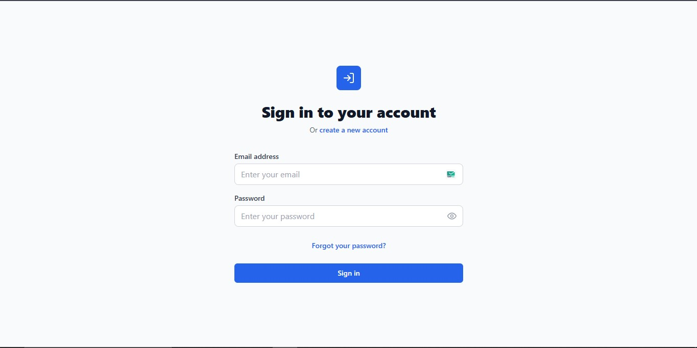
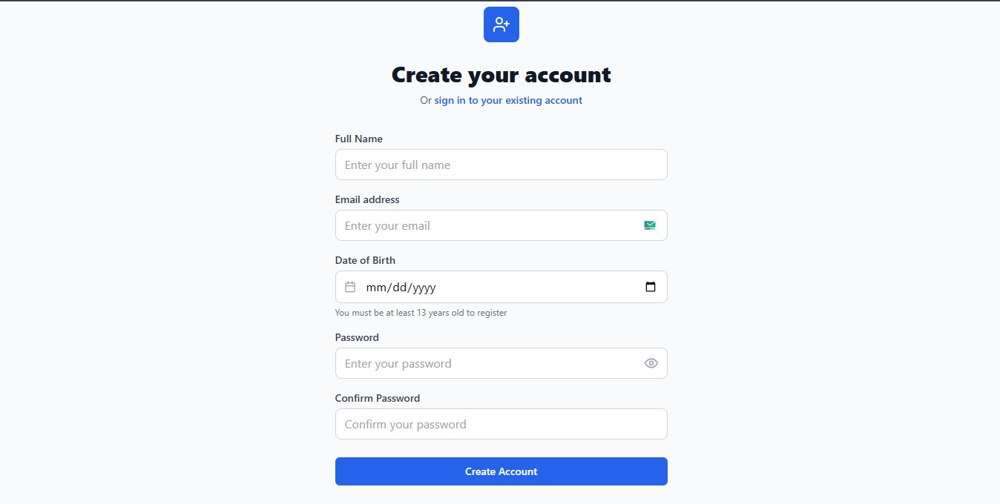
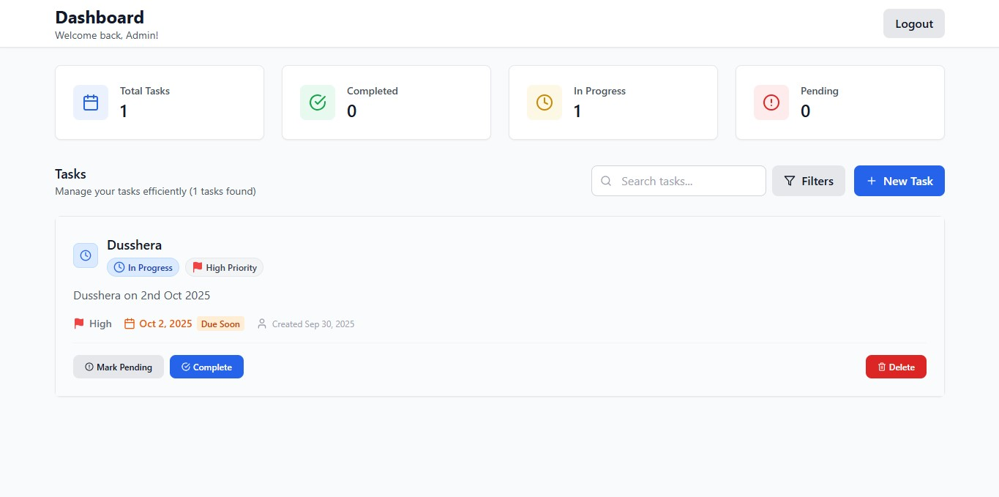

# Scalable Web App with Authentication & Dashboard

A full-stack web application built with React.js frontend and Node.js/Express backend featuring user authentication, task management, and a responsive dashboard.

## 🛠️ Tech Stack

### Frontend
- React.js 18
- Tailwind CSS
- React Router
- Axios for API calls
- Lucide React icons

### Backend
- Node.js
- Express.js
- MongoDB with Mongoose
- JWT Authentication
- bcryptjs for password hashing

## 🚀 Features

- ✅ User Registration & Login
- ✅ JWT Authentication
- ✅ Password Reset with Date of Birth
- ✅ Task Management (CRUD)
- ✅ Responsive Dashboard
- ✅ Search & Filter Tasks
- ✅ Protected Routes

## 📦 Installation

### Prerequisites
- Node.js (v14 or higher)
- MongoDB
- Git

### Backend Setup
```bash
cd backend
npm install
cp .env.example .env
# Edit .env with your configurations
npm run dev

### Frontend Setup
```bash
cd frontend
npm install
npm run dev


##🔧 Environment Variables
Backend (.env)
NODE_ENV=development
PORT=5000
MONGODB_URI=mongodb://localhost:27017/scalable-app
JWT_SECRET=your_super_secure_jwt_secret_key_here
FRONTEND_URL=http://localhost:3000


📝 API Endpoints
Authentication
POST /api/auth/register - User registration
POST /api/auth/login - User login
GET /api/auth/me - Get current user

Tasks
GET /api/tasks - Get all tasks (with filtering)
POST /api/tasks - Create a new task
PUT /api/tasks/:id - Update a task
DELETE /api/tasks/:id - Delete a task

Password Reset
POST /api/password/forgot - Forgot password
PUT /api/password/reset - Reset password

🎯 Usage
Register a new account
Login with your credentials
Access the dashboard
Create, edit, and manage tasks
Use search and filters to find tasks

📱 Screenshots
### Login Page


### Register Page


### Dashboard



🤝 Contributing
Fork the project
Create your feature branch (git checkout -b feature/AmazingFeature)
Commit your changes (git commit -m 'Add some AmazingFeature')
Push to the branch (git push origin feature/AmazingFeature)
Open a Pull Request

📄 License
This project is licensed under the MIT License.
